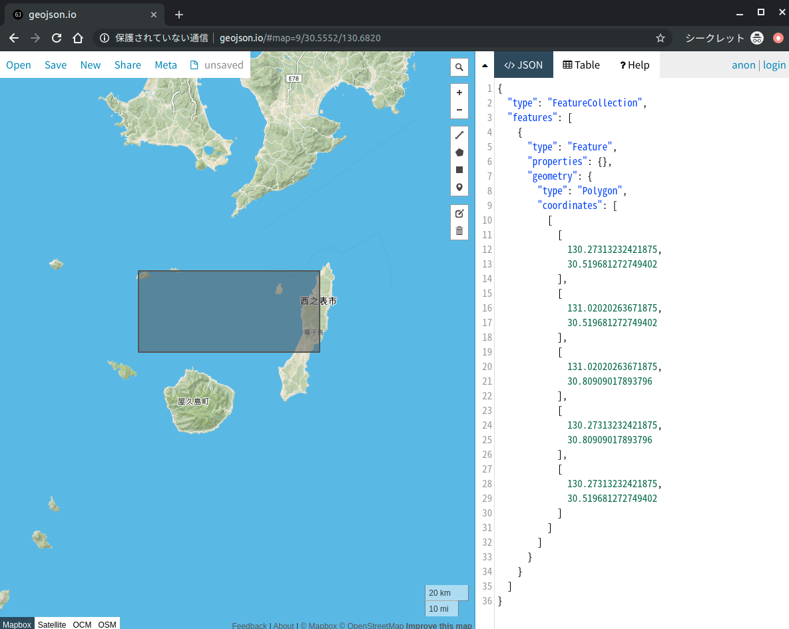

SQL practices
===

### ToC

- [Practice 1](#practice-1)
- [Practice 2](#practice-2)
- [Practice 3](#practice-3)

# Practice 1

- Count the number of subordinate 'ENTERPRISE\_CUSTOMER' organizations for each organization.

# Practice 2

- Calculate the center of each `japan_segment`.

# Practice 3

- Select `japan_segments` within the bounds represented as the following GeoJSON.

```json
{
  "type": "FeatureCollection",
  "features": [
    {
      "type": "Feature",
      "properties": {},
      "geometry": {
        "type": "Polygon",
        "coordinates": [
          [
            [
              130.27313232421875,
              30.519681272749402
            ],
            [
              131.02020263671875,
              30.519681272749402
            ],
            [
              131.02020263671875,
              30.80909017893796
            ],
            [
              130.27313232421875,
              30.80909017893796
            ],
            [
              130.27313232421875,
              30.519681272749402
            ]
          ]
        ]
      }
    }
  ]
}
```


